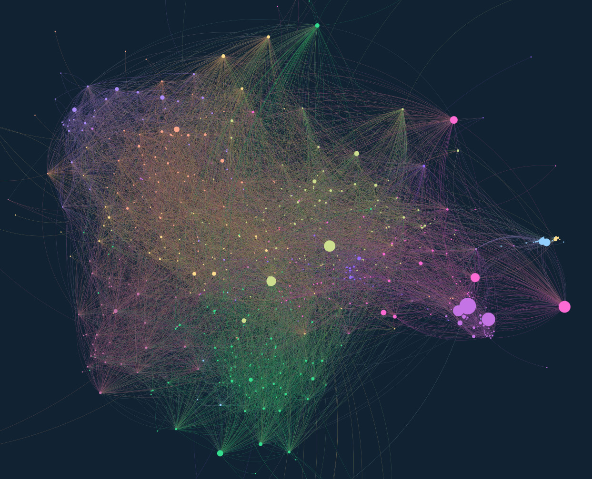
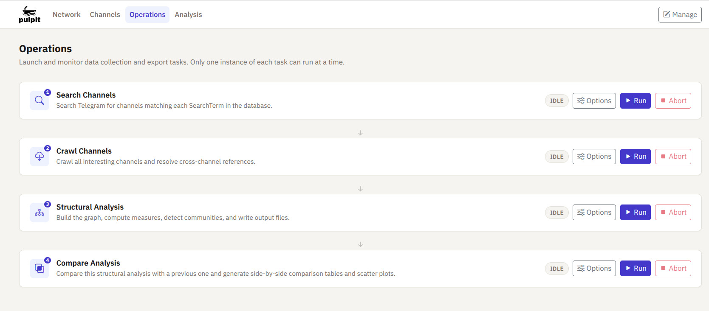

# Pulpit

### Political undercurrents: linkage, propagation, influence on Telegram

**Map influence, information flow, and community structure in Telegram networks.**

Telegram channels constantly reference each other — forwarding messages, linking to one another, amplifying certain voices and ignoring others. These cross-references are not random: they reveal alliances, ideological clusters, and influence networks that are otherwise invisible. Pulpit makes those networks visible.

<figure>



<figcaption><em>~700 channels, ~12,000 edges. Leiden directed community detection, PageRank nodes size, vapoRwave palette.</em></figcaption>
</figure>
<br>

Pulpit collects messages from a set of Telegram channels you define, traces every forward and every `t.me/` link between them, and turns the result into an interactive map you can explore in a browser — zooming in on individual channels, filtering by community, comparing the reach of different actors.

The analytical layer is built on established graph-theory methods: [PageRank](docs/network-measures.md#pagerank), [betweenness centrality](docs/network-measures.md#betweenness-centrality), [Burt's structural holes](docs/network-measures.md#burts-constraint), [Leiden community detection](docs/community-detection.md#leiden), [Infomap echo-chamber detection](docs/community-detection.md#infomap), [SIR spreading simulation](docs/network-measures.md#spreading-efficiency), and more. Measures that are standard in network science are applied to the specific dynamics of Telegram forwarding networks. The software is actively developed; see the [changelog](CHANGELOG.md) for recent additions.

<figure>



<figcaption><em>The four-step pipeline: search channels → crawl channels → structural analysis → compare analysis.</em></figcaption>
</figure>
<br>

---

## Who this is for

- **Investigative journalists** mapping political influence networks, disinformation ecosystems, or coordinated information campaigns
- **Academic researchers** in political communication, network science, computational social science, and disinformation studies
- **Activists and NGOs** monitoring specific Telegram ecosystems — far-right networks, health misinformation communities, foreign-influence operations
- **Students** in digital methods, computational journalism, or media studies courses

---

## Quick start

```sh
git clone https://github.com/giovabal/pulpit
cd pulpit
sh setup.sh
# Edit .env: set TELEGRAM_API_ID, TELEGRAM_API_HASH, TELEGRAM_PHONE_NUMBER
python manage.py migrate && python manage.py runserver
```

Open [http://localhost:8000](http://localhost:8000). The entire workflow runs from the browser from here. See [Getting started](docs/getting-started.md) for setup details, Telegram credential registration, and database configuration.

---

## How it works

1. **Find channels** — add keywords; Pulpit searches Telegram and populates a list of matching channels
2. **Organise** — assign channels to categories (by political orientation, country, topic, or any criterion you choose)
3. **Crawl** — collect messages and resolve every forward and `t.me/` link into a directed citation graph
4. **Export** — run community detection and layout; export an interactive map, sortable tables, and network exchange files

---

## What you get

After the export completes, the output directory contains:

- **Interactive 2D graph** (`graph.html`) — search, filter by community, resize nodes by any measure, click for detail — [more](docs/export-formats.md#graphhtml--2d-interactive-graph)
- **Interactive 3D graph** (`graph3d.html`) — Three.js, rotate/zoom/inspect — [more](docs/export-formats.md#graph3dhtml--3d-interactive-graph)
- **Channel table** (`channel_table.html/.xlsx`) — one row per channel with all 14 computed measures, sortable — [more](docs/export-formats.md#channel_tablehtml--xlsx--per-channel-metrics)
- **Network statistics table** (`network_table.html/.xlsx`) — whole-network metrics, scatter plot — [more](docs/export-formats.md#network_tablehtml--xlsx--whole-network-statistics)
- **Community table** (`community_table.html/.xlsx`) — per-community metrics for each detection strategy — [more](docs/export-formats.md#community_tablehtml--xlsx--per-community-metrics)
- **Timeline animation** — step through annual snapshots with animated transitions — [more](docs/workflow.md#timeline-export)
- **Network comparison** (`network_compare_table.html`) — compare two exports side by side — [more](docs/workflow.md#network-comparison)
- **GEXF and GraphML** — for downstream analysis in Gephi or Cytoscape — [more](docs/export-formats.md#networkgexf--networkgraphml--network-exchange-formats)

---

## Documentation

| File | Contents |
| :--- | :------- |
| [Getting started](docs/getting-started.md) | Requirements, installation, credentials, database setup, access control |
| [Workflow](docs/workflow.md) | Step-by-step guide: search → organise → crawl → export; all CLI options |
| [Network measures](docs/network-measures.md) | All 14 per-channel measures with academic references and examples |
| [Community detection](docs/community-detection.md) | 13 algorithms, consensus matrix, cross-strategy comparison, choosing a strategy |
| [Whole-network statistics](docs/whole-network-statistics.md) | Ecosystem-level metrics: density, reciprocity, clustering, Fiedler value, E-I index, and more |
| [Vacancy analysis](docs/vacancy-analysis.md) | Identifying structural replacement channels after a node disappears |
| [Web interface](docs/web-interface.md) | Browser UI: channel browser, channel detail pages, Operations panel, backoffice |
| [Export formats](docs/export-formats.md) | All output files: graphs, tables, GEXF, GraphML, atomic write safety |
| [Configuration](CONFIGURATION.md) | All `.env` settings |
| [Changelog](CHANGELOG.md) | Version history |

---

## Technical foundation

Pulpit is built around three components:

**Crawling.** The official Telegram API (via [Telethon](https://github.com/LonamiWebs/Telethon)) downloads messages from the channels you select. For each message, Pulpit records forwards (which channel's content was reposted) and inline `t.me/` references (links to other channels). This produces a directed, weighted graph: an edge from channel A to channel B means A regularly amplifies B's content, with weight reflecting frequency relative to A's total output.

**Analysis.** The graph is analysed with [NetworkX](https://networkx.org/). Node-level measures — PageRank, HITS, betweenness, Burt's constraint, spreading efficiency, and others — rank channels by influence, reach, or structural importance. Community detection algorithms (Leiden, Louvain, Infomap, MCL, K-core, and more) identify clusters of channels that behave as coherent ecosystems. Whole-network statistics characterise the ecosystem as a system.

**Visualisation.** The graph is laid out using [ForceAtlas2](https://github.com/bhargavchippada/forceatlas2), a force-directed algorithm that naturally pulls tightly connected clusters together. The result is exported as a self-contained HTML file powered by [Sigma.js](http://sigmajs.org/), with controls for searching, filtering by community, changing node size by any computed measure, and inspecting individual channels. An optional 3D version is rendered with [Three.js](https://threejs.org/).

---

## Disclaimer

Pulpit is intended for academic research, investigative journalism, and analytical work on publicly accessible Telegram channels. It was written with the aim of complying with applicable laws and with [Telegram's Terms of Service](https://telegram.org/tos) as they stood at the time of development.

Laws governing data collection, storage, and analysis of public communications vary across jurisdictions and change over time. Telegram's Terms of Service are likewise subject to revision. It is your responsibility to verify that your use of this software complies with the laws of your country and with Telegram's current Terms of Service before running it. The authors accept no liability for uses that fall outside lawful research and analysis.


